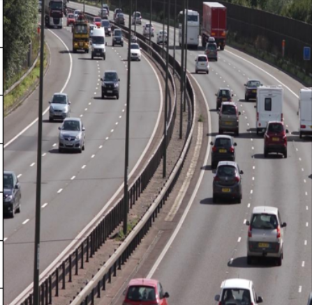
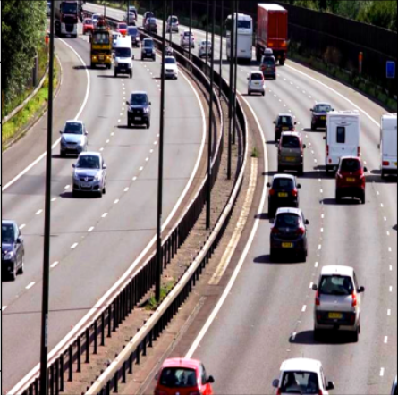
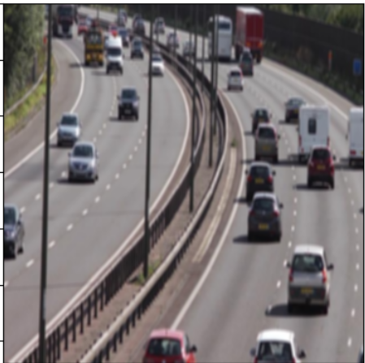
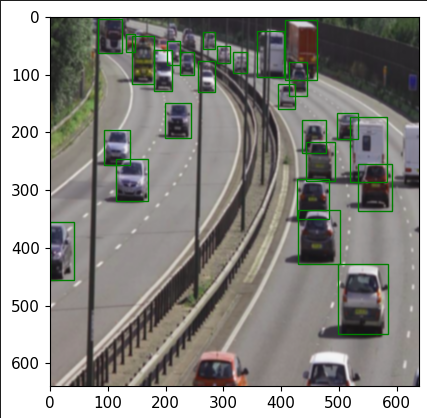
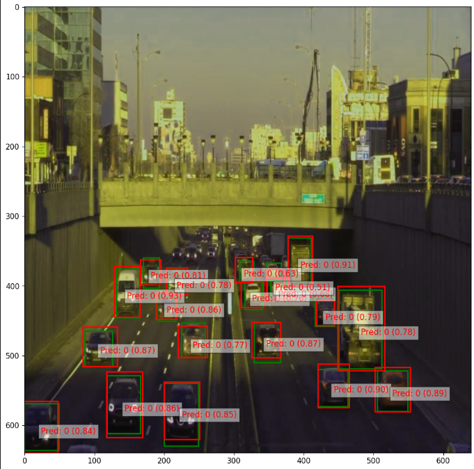

# ML4641Project

## Introduction/Background

For our project we wish to apply object-detection to the field of self-driving, specifically by implementing machine learning models that can detect vehicles, specifically cars, as shown in our [dataset](https://www.kaggle.com/datasets/farzadnekouei/top-view-vehicle-detection-image-dataset). We indicated that we were going to use a different dataset in the project proposal, but we ended up changing to this dataset. This dataset includes around 500 training images as well as around 100 testing images, where images come with a corresponding set of labels which indicate the size, position, and type of objects located in the image. If we end up needing more data, particularly to train some of the larger deep learning models we plan on using other datasets like the [car tracking and object detection dataset](https://www.kaggle.com/datasets/trainingdatapro/cars-video-object-tracking), which contains similar images, albeit at a different angle, perhaps allowing our models to better generalize. We currently plan on finetuning a variety of state-of the art object detection models [1], such as YOLO-v7 [2], and have looked at how others have applied such models onto the problem of vehicle detection [3].

## Problem Definition

With self-driving cars becoming more and more relevant in current society, it is crucially important that they are able to detect other vehicles to prevent collisions in a reliable, quick manner. We seek to explore and expand upon existing methods of using machine learning techniques to detect vehicles.

## Methods

Due to the relatively low amount of data, we plan on increasing the amount and diversity of the data using data augmentation techniques such as color jittering, gaussian noise, or blurring. We will also normalize our data, changing the intensity of the pixels to a more consistent distribution. Finally we will resize all the images to a common size, to ensure images have a consistent input size.

Finally, for our supervised techniques, we plan on training a plain neural network on the object-detection dataset, just to gain a minimum baseline on which more advanced models can improve on. We then plan on fine-tuning state of the art object detection models, such as YOLO or R-CNN. Finally, we will look at more novel object detection methods, such as those involving ViTs (Vision Transformers). As these models require lots of computational power to train, we plan on training them via either google colab or PACE-ICE.

### Implemented Method

We currently have fine-tuned a small YOLO-v5 model on our dataset, with all the code present to do so in test.ipynb. We used Batch Gradient Descent over 30 epochs, using the Adam optimizer with a learning rate of .0001. When we were pre-processing data, we performed data augmentation via color jittering and gaussian blurring through pytorch transforms, then ensured each image was 640 by 640 as input into the neural network. We are also using a custom loss function that was implemented in the yolov5 code we are using. The loss function includes three components, covering three areas (classification, confidence, and IoU overlap).

Below is a standard image from our dataset, without any transformations:

#### Color Jittering

Color jittering is applied via the transforms.ColorJitter torch transform, with a brightness of .4, a contrast of .4, a saturation of .4, and a hue of .4. These values determine how much exactly the brightness, contrast, saturation, and hue are randomly jittered. Below is a version of the above image
with color jittering:

Color jittering is random and so putting an image in a color jitter twice is bound to give you two, slightly different images. This means that for every
epoch, we are looking at slightly different images than from the last epoch. This, in a way, increases the multiplies the size of our dataset by the number of epochs carried out.

#### Gaussian Blurring

Gaussian Blurring was applied via the transforms.GaussianBlur torch transform, with a kernel_size of (5,9) and sigma values of (.1,5). The sigma values define the standard deviation used for creating the kernel to perform the blurring. The gaussian kernel is then just convolved with the data in a similar matter to the convolutions in a convolutional neural network, or like in non-parameteric density estimation methods.
Below is a version of of the above image with gaussian blurring:

## Results and Discussion

We plan to use accuracy, latency, as well as mAP (mean average precision), a benchmark often used for detection problems. While it may be unrealistic to achieve in the tight timeframe of this project, we hope to be able to create/fine-tune object detection models capable of detecting vehicles with quantitative metrics at the level other papers have achieved on the same problem. For example, [3] was able to train a YOLOv3 model to achieve a mAP of 72.8. Realistically though, we hope to be able to train/finetune an object-detection model at a minimum mAP of around 20-30, a base value which should hopefully indicate that our model is able to identify vehicles with reasonable accuracy.

### Visualizations

The above image is an example image from the training data set. The borders around each object are called the "bounding boxes", and we aim to train our model to construct boxes just like these. The green boxes present above represent the labels given in the dastaset.

This is an image that our model has been evaluated on, with bounding boxes constructed for each object detected, as well as their associated confidence levels (between 0 and 1).

The red boxes show the predicted bounding boxes while the green boxes show the actual labels. You can clearly see that the object detection model is properly detecting cars, although because of the inconsistent ground truth labeling (a lot of the far away vehicles don't have bounding boxes even if they are vehicles), the model sometimes predicts objects even when they aren't technically present in the ground truth labeling.

### Quantitative Metrics

#### YOLOv5n

#### YOLOv5m

#### YOLOV5x

#### Combined

### Analysis of Graphs

The above graphs show the loss and mAP of the both the train and test data of each model, as well as the latency of each model. There are 3 different YOLOv5 models of varying sizes. YOLOv5n has about 1 million parameters, YOLOv5m has around 20 million parameters, and YOLOv5x has around 80 million parameters.

#### **Latency**

All latency metrics were computed on an H100 compute node in PACE-ICE. The GPU was was warmed up before calculations took place, and the latency it took the model to process one image was measured 300 times, then graphed on a box plot. As you can see from the boxplots, both the YOLOv5n and YOLOv5m model take around 3.5 ms, while the larger YOLOv5x takes around 7 ms. Be aware that if images were passed in as batches instead of individually, the latency per image would be greatly reduced, due to parellization.

#### **Loss**

Almost every single loss curve, for each model and train vs. test have the same shape, with a rapid decrease in the beginning which tapers of. Every model consistently has a lower train loss than test loss, which makes sense as there is bound to be a slight amount of variance. As can be expected, the train data of the largest model has the lowest loss, while all the other loss curves are higher to varying degrees.

#### **mAP**

mAP, or mean average precision, is the main benchmark used for object detection models. As can be seen from the graphs, almost always at the end the model overfits and the train accuracy continues to grow past the point where the test grows. We don't actually see significant differences between the two larger models, but they are both significantly better than the smaller model.

### Next Steps

We have looked at a variety of object detection architectures from the YOLOv5 family of models, as well as played around with variational Auto-encoders to find a non-linear latent representation of our data. In the future, if we continue this project, we would definetely like to look at a variety of other object detection architectures, like Fast-RCNN, or other non CNN based architectures, such as ones based on ViT's, Vision Transformers.

## References

[1] S. S. A. Zaidi, M. S. Ansari, A. Aslam, N. Kanwal, M. Asghar, and B. Lee, “A Survey of Modern Deep Learning based Object Detection Models.” arXiv, May 12, 2021. doi: 10.48550/arXiv.2104.11892.

[2] C.-Y. Wang, A. Bochkovskiy, and H.-Y. M. Liao, “YOLOv7: Trainable bag-of-freebies sets new state-of-the-art for real-time object detectors.” arXiv, Jul. 06, 2022. doi: 10.48550/arXiv.2207.02696.

[3] Y. Chen and Z. Li, “An Effective Approach of Vehicle Detection Using Deep Learning,” Comput Intell Neurosci, vol. 2022, p. 2019257, Jul. 2022, doi: 10.1155/2022/2019257.

## Contributions

### Proposal Chart

| **Member** | **Contributions**                           |
| ---------- | ------------------------------------------- |
| Ankith     | Website, writing problem definition/methods |
| Emanuel    | Wrote Introduction and Introduced Idea      |
| Jeet       | Research                                    |
| Charles    | Research                                    |
| Vikranth   | Video Presentation                          |

### Gant Chart (See Excel File in Repo For More Information)

| **Member** | **Contributions**                                         |
| ---------- | --------------------------------------------------------- |
| Ankith     | Incorporating Neural Networks, Work on Research           |
| Emanuel    | Incorporating Neural Networks and data through R-CNN, etc |
| Jeet       | Visualizations and Organization of Data                   |
| Charles    | Writing Report and Organizing Information                 |
| Vikranth   | Analyzing Dataset through Augementation/Research          |

## Repo Structure

- yolov5: Contains all the code from the ultralytics yolov5 implementation
- requirements.txt: pip installable requirements
- run_model.ipynb: Where all the code for finetuning various YOLOv5 models on our dataset is
- modified_yolov5n.yaml: YOLOv5n model architecture but with a modified head to predict for one class
- modified_yolov5s.yaml: YOLOv5s model architecture but with a modified head to predict for one class
- modified_yolov5m.yaml: YOLOv5m model architecture but with a modified head to predict for one class
- modified_yolov5l.yaml: YOLOv5l model architecture but with a modified head to predict for one class
- modified_yolov5x.yaml: YOLOv5x model architecture but with a modified head to predict for one class
- README.md : This README file
- variational_autoencoder.py: Work in progress implementation of a variational auto-encoder
- create_graphs.ipynb: Script to creates graphs
- images: Some images used in README
- metrics: Contains images of metrics and the metrics themselves, like mAP, loss, and latency
- gant_chart.xlsx: Chart of all the responsibilities
